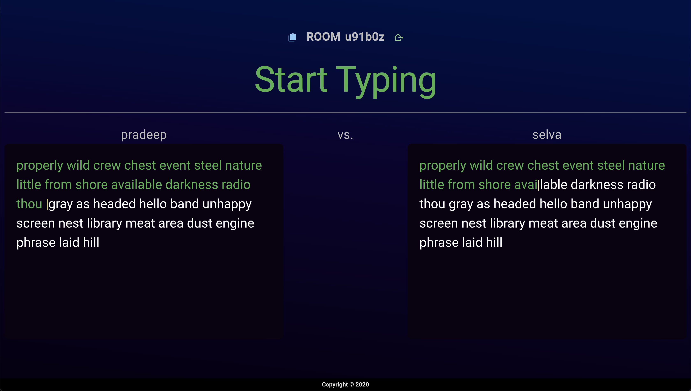

# Arcadia TypeRace

- A website to challenge your friends to a typing race, powered by Go, Vue and WebSockets.
- Join/Create a room and invite your friends to challenge them to a typing race.
  Find out who's faster! Good luck.
- ADDITIONAL FEATURE: users of [arcadia bot](https://github.com/Pradeep-selva/Arcadia-Bot) can generate a new room using the function `+typerace`.
- [Visit site](https://arcadia-typerace.web.app/) to see it in action.
- To get a simple demo, run `index.html` from `client-test`, alongside `main.go` from `ws-server`.

## Screenshots

---

## Built using

- Go
- Typescript
- Vue
- Vuetify
- WebSockets
- Docker
- Azure
- Firebase

## Steps to run locally

- Clone the repo and install dependencies with `npm install` (or) `yarn` in `client_ui`, and `go mod vendor` in `ws-server`.
- Create a file named `secrets.ts` in src directory of `client-ui` and export a constant named `SECRETS` containing your x-api-key, which must be added to `ws-server` too.
- In root directory run `cd client-ui && yarn serve` and `cd ws-server && go run main.go`.
- go to `localhost:8080`

## License

[MIT](LICENSE) © [Pradeep-selva](https://github.com/Pradeep-selva)
